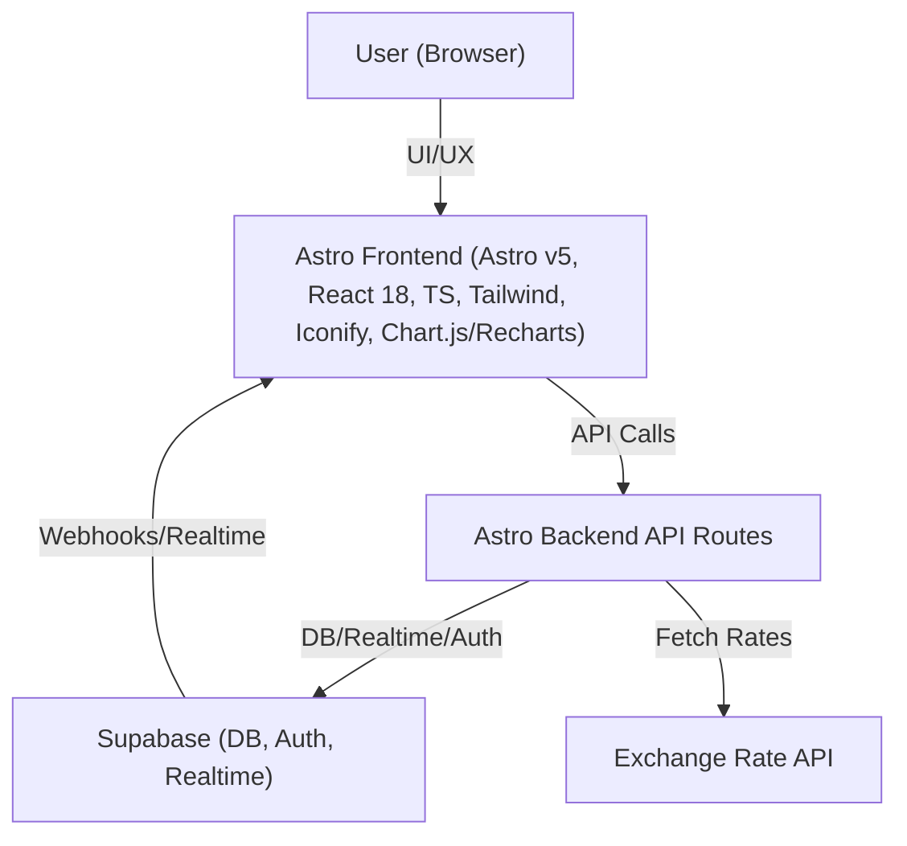

# Astro Starter Kit: Minimal

```sh
npm create astro@latest -- --template minimal
```

[](https://stackblitz.com/github/withastro/astro/tree/latest/examples/minimal)
[](https://codesandbox.io/p/sandbox/github/withastro/astro/tree/latest/examples/minimal)
[](https://codespaces.new/withastro/astro?devcontainer_path=.devcontainer/minimal/devcontainer.json)

> 🧑‍🚀 **Seasoned astronaut?** Delete this file. Have fun!

## 🚀 Project Structure

Inside of your Astro project, you'll see the following folders and files:

```text
/
├── public/
├── src/
│   └── pages/
│       └── index.astro
└── package.json
```

Astro looks for `.astro` or `.md` files in the `src/pages/` directory. Each page is exposed as a route based on its file name.

There's nothing special about `src/components/`, but that's where we like to put any Astro/React/Vue/Svelte/Preact components.

Any static assets, like images, can be placed in the `public/` directory.

## 🧞 Commands

All commands are run from the root of the project, from a terminal:

| Command                   | Action                                           |
| :------------------------ | :----------------------------------------------- |
| `npm install`             | Installs dependencies                            |
| `npm run dev`             | Starts local dev server at `localhost:4321`      |
| `npm run build`           | Build your production site to `./dist/`          |
| `npm run preview`         | Preview your build locally, before deploying     |
| `npm run astro ...`       | Run CLI commands like `astro add`, `astro check` |
| `npm run astro -- --help` | Get help using the Astro CLI                     |

## 👀 Want to learn more?

Feel free to check [our documentation](https://docs.astro.build) or jump into our [Discord server](https://astro.build/chat).

# Personal Finance Tracking Web App

## Architecture Overview



## Tech Stack

### Frontend

- **Astro v5**: Modern static site generator, supports SSR and islands architecture.
- **React v18**: For interactive components (forms, charts, etc.).
- **TypeScript**: Type safety across the codebase.
- **Tailwind CSS**: Utility-first CSS for rapid, responsive design.
- **@iconify-json/ri**: Icon set for UI elements.
- **Chart.js** or **Recharts**: For dynamic, interactive charts.
- **Font: Inter**: Dynamically loaded for all UI text.

### Backend (Inside Astro)

- **Astro API Routes**: For server-side logic (currency conversion, budget alerts, etc.).
- **Supabase Client**: Used in API routes for DB, authentication, and real-time features.
- **Exchange Rate API Integration**: Fetches live rates for RON, EUR, USD.

### Database

- **Supabase (PostgreSQL)**: Stores users, expenses, budgets, investments.
- **Supabase Auth**: Handles user authentication (email/password, OAuth).
- **Supabase Realtime**: For real-time budget alerts and updates.

## App Structure

### Main Sections

1. **Home**
   - Dashboard: Overview of expenses, budgets, investments.
   - Dynamic charts for spending, budget progress, investment growth.
   - Currency switcher (RON/EUR/USD) with live recalculation.
2. **Add Expense**
   - Form to add new expenses (amount, category, date, notes).
   - Currency input, auto-converted to selected currency.
3. **Add Yearly Budget**
   - Set yearly budget per category.
   - Real-time feedback on budget usage.
4. **Investments**
   - Track investments (type, amount, value, growth).
   - Charts for investment performance.

## Key Features

- **Responsive Design**: Mobile-first, works on all devices.
- **User Authentication**: Secure login/signup via Supabase Auth.
- **Live Currency Conversion**: Fetches rates from a public API, recalculates all values.
- **Dynamic Charts**: Visualize data with Chart.js or Recharts.
- **Real-time Budget Alerts**: Notifies users when approaching/exceeding budgets (via Supabase Realtime).
- **Modern UI**: Uses Inter font, Iconify icons, and Tailwind for a clean look.

## Example Directory Structure

```
src/
  components/
    CurrencySwitcher.tsx
    ExpenseForm.tsx
    BudgetForm.tsx
    InvestmentTable.tsx
    Chart.tsx
    Alert.tsx
  layouts/
    MainLayout.astro
  pages/
    index.astro         # Home
    add-expense.astro
    add-budget.astro
    investments.astro
    api/
      exchange-rate.ts  # API route for currency rates
      alert.ts          # API route for budget alerts
  utils/
    supabaseClient.ts
    currencyUtils.ts
    chartUtils.ts
  styles/
    tailwind.css
public/
  fonts/
    inter-variable.woff2
```
